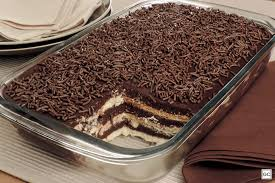

# receita1

- **index.html** → Arquivo principal com a receita.  
- **img/favicon.ico** → Ícone da página.  
- **receita.jpg** → Imagem ilustrativa do pavê de brigadeiro.  

---

## 🛠️ Tecnologias Utilizadas  
- **HTML5** → Estruturação da página.  
- **Imagens** → Para ilustrar a receita.  
- **Favicons** → Personalização do ícone da aba do navegador.  

---

## 🚀 Funcionalidades  
- Exibe o **nome da receita** em destaque.  
- Lista **ingredientes** com formatação organizada.  
- Explica o **modo de preparo passo a passo** dividido em creme branco, creme preto e montagem.  
- Mostra uma **imagem do doce pronto**.  

---

## 📖 Receita (Resumo)  

### Ingredientes Principais:  
- 2 pacotes de biscoito de amido de milho  
- 1 lata de leite condensado  
- 1 lata de creme de leite  
- 200g de achocolatado  
- 200ml de leite  
- 1 pacote de Oreo  
- Granulado para decorar  

### Modo de Preparo:  
1. Preparar o creme branco (ponto de mingau).  
2. Molhar bolachas no leite com achocolatado e montar camadas.  
3. Preparar o creme preto (brigadeiro + creme de leite).  
4. Alternar camadas de bolacha, creme e brigadeiro.  
5. Finalizar com Oreo triturado e granulado.  
6. Levar à geladeira antes de servir.  

---

## ▶️ Como Executar  
1. Baixe ou clone o repositório.  
2. Certifique-se de que os arquivos `receita.jpg` e `favicon.ico` estejam no diretório correto.  
3. Abra o arquivo **index.html** no navegador.  
4. Aproveite a experiência de visualizar a receita digitalmente.  

---

## 📸 Demonstração de Código  

Exemplo de uso da imagem com tamanho definido:  

```html

